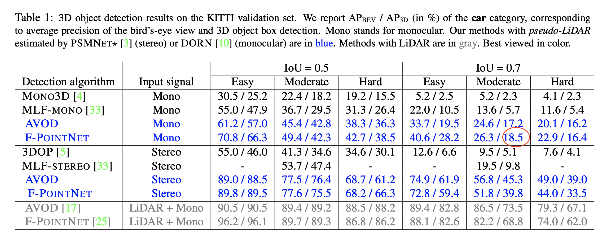

#  [Monocular 3D Object Detection with Pseudo-LiDAR Point Cloud](https://arxiv.org/abs/1903.09847)

_August 2019_

tl;dr: End-to-end pseudo-lidar training with 2D/3D bbox consistency loss.

#### Overall impression
This paper's main idea largely overlaps with that of [pseudo ldiar](pseudo_lidar.md). The main problem with pseudo-lidar is the noise (i.e., depth inaccuracies, long tails) in the reprojected 3d point cloud due to blurry boundaries. [Pseudo lidar ++](pseudo_lidar++.md) proposes to use sparse depth measurement to alleviate this problem, while this study uses 2D and 3D bounding box consistency (similar to [deep3DBox](deep3dbox.md)).

**However there is a major problem with the current approach.** The idea of trying to predict a correct 3d bbox from a noisy point cloud is not optimal and t**he 3d box prediction get even "contaminated" from the 2d-3d bbox consistency**. A better way is to finetune the point cloud generation process as well. This requires propagating the depth gradient to the depth net.

[Pseudo-lidar++](pseudo-lidar) tackles this fundamental problem and achieves better performance, but it requires supervision from sparse depth measurements.

**Note that DORN's training data overlaps with object detection's validation data, and suffers from overfitting.** Both [pseudo lidar](pseudo_lidar.md) and [pseudo lidar e2e](pseudo_lidar_e2e.md) suffer from this problem. According to the [ForeSeE](foresee_mono3dod.md) paper, if the validation data is excluded from the training of depth map, then PL's performance drops from 18.5 to 5.4 AP_3D at IoU=0.7.

#### Key ideas
- Limitations with depth sensors 
	- Stereo cameras: calibration and synchronization
	- Depth camera: limited working range (<10m)
	- Lidar: high cost
- The noise in pseudo-lidar point cloud
	- local misalignment due to inaccuracies in depth
	- long tail "bleeding edge artifacts" from blurry object edges in depth maps 
- Architecture
	- Depth generation: pretrained model
	- pseudo-lidar Generation: use extrinsic matrix [R t] to transform to body frame (as 3d bbox annotation is in body frame)
	- Frustum pointnet for 3d bbox estimation
		- instance mask instead of bbox to extract frustum (this is to curb **long tail**)
		- point cloud instance segmentation
	- Adjust 3D bbox to align with 2d bbox
- 2D-3D bbox consistency
	- Convert 3d bbox to 8 corner representation and get MBR (minimum bounding rectangle)
	- During training, 2d-3d bbox consistency is used to regularize the 3D bbox prediction. During inference, the consistency is solved as an optimization problem, similar to [deep3dbox](deep3dbox.md).

#### Technical details
- Many components seems to be used as pretrained off-the-shelf modules, such as the depth estimation net and the instance segmentation net. 

#### Notes
- Q: Can we incorporate the limited length of cars as priors to regularize the projection? Maybe refine the depth map using the 3D prior info. Or can we skip the edges?
- The main problem of the paper is that the 3d bbox prediction is on top of a noisy 3d point cloud. The detector is definitely not optimal. Maybe detach the gradient from the 2d-3d bbox consistency is a better idea.

